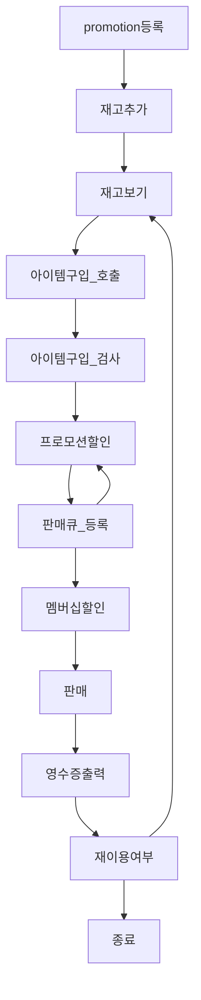

# java-convenience-store-precourse

# 기능 요구사항
- 결제 시스템
- 재고 관리
- 프로모션 할인
- 멤버십 할인
- 영수증 출력

# State Diagram

# 기능 목록 & 기능 우선순위
- [ ] 프로모션 등록
  - 사전조건
    - 애플리케이션이 시작될 때 실행되어야 한다
  - 사후조건
    - 등록된 프로모션을 문자열을 통해 빠르게 탐색할 수 있어야 한다.
- [ ] 재고 추가
  - 사전조건
    - 프로모션이 등록되어 있어야 한다
  - 사후조건
    - 아이템 별로 프로모션이 가능하다면, 프로모션이 등록되어있어야 한다
    - 아이템 별로 문자열로 검색하면, 해당 아이템 객체를 받아올 수 있어야 한다.
- [ ] 프로모션할인
  - 사전조건
    - 구매하고자 하는 아이템이 입력으로 들어와야 한다
  - 사후조건
    - 재고가 모자란 경우, 사용자가 물품을 덜 들고온 경우, 프로모션이 없는 경우가 모두 정상적으로 처리되어야 한다
- [ ] 아이템구입_검사
  - 사전조건
    - 아이템 구입 메소드가 정상적으로 반환한 리스트를 받아야 한다.
  - 사후조건
    - 각 아이템들의 재고가 충분한 상태에만 정상적으로 반환되어야 한다.
- [ ] 재고 보기
  - 사전조건
    - 재고가 추가된 상태여야 한다
  - 사후조건
    - 없음
- [ ] 멤버십 할인
  - 사전조건
    - 모든 구매 물품에 대한 프로모션 할인 적용 여부가 결정되어야 한다.
  - 사후조건
    - 멤버십 할인이 적용될 가격이 출력으로 주어져야 한다
- [ ] 아이템구입_호출
  - 사전조건
    - 재고가 보여진 상태에서 호출되어야 한다.
  - 사후조건
    - 구입하고자 하는 아이템들이 반환되어야 한다.
- [ ] 판매
  - 사전조건
    - 판매되어야 하는 재고와 그 가격들이 모두 완성되어야 한다.
  - 사후조건
    - 재고가 구매물품의 수량만큼 감소해야 한다.
- [ ] 영수증 출력
  - 사전조건
    - 판매된 재고와 그 가격, 할인된 가격이 입력으로 주어져야 한다
  - 사후조건
    - 영수증을 출력한다
- [ ] 재이용 여부 확인
  - 사전조건
    - 영수증 출력이 완료되어야 한다.
  - 사후조건
    - 재이용 여부에 따라, 종료 상태 혹은 재고 보기 상태로 이동해야 한다.

# 커스텀 기능 요구사항
- 구입 과정 도중 예외가 발생할 경우, 재고가 소진되지 않고 결제 처리가 되지 않아야 한다.
